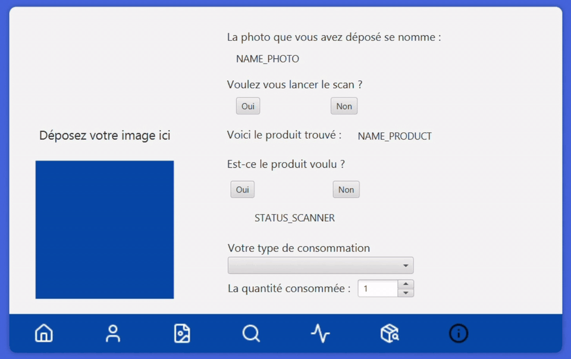
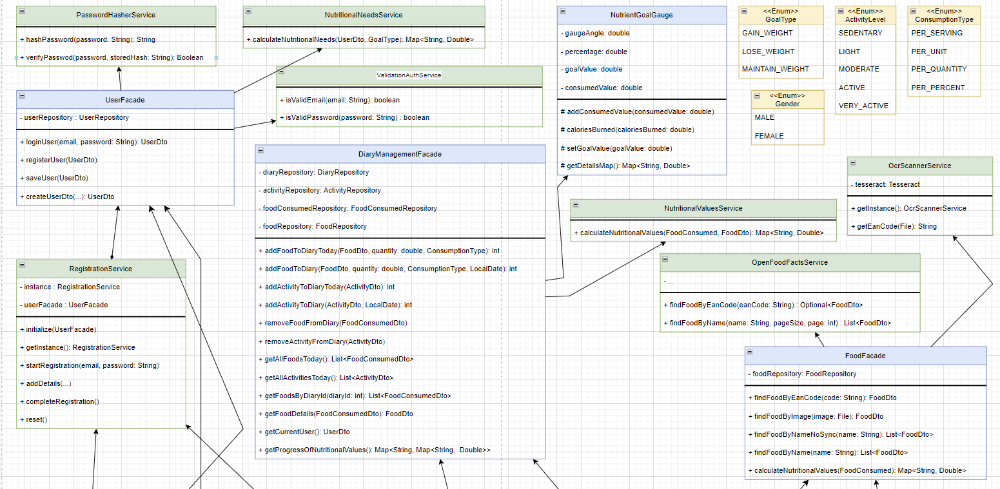
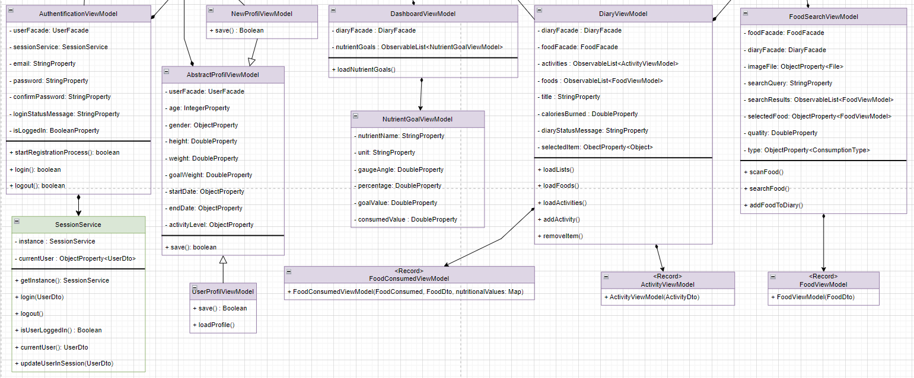
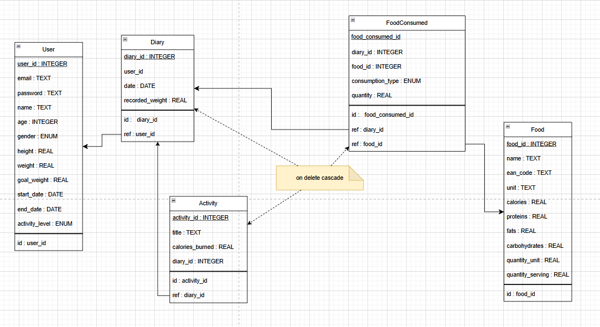

<div align="center">

# Mètre-moi au régime

**Desktop nutrition tracker built with JavaFX — log your meals, scan products and follow your daily calorie and macronutrient goals.**




</div>

## Table of contents

- [About](#about)
- [Demo](#demo)
- [Features](#features)
- [Tech stack](#tech-stack)
- [Architecture](#architecture)
- [Project structure](#project-structure)
- [Getting started](#getting-started)
- [Testing](#testing)
- [Team](#team)
- [Roadmap](#roadmap)
- [Acknowledgements](#acknowledgements)

## About

**Mètre-moi au régime** is a desktop application that helps users follow a diet. Based on the user's profile
(age, height, weight, activity level and goal), it computes daily calorie and macronutrient needs, lets the user
log the food they eat and the activities they do, and shows their progress towards their goals in real time.

Products can be found by name or barcode (EAN) through the [Open Food Facts](https://world.openfoodfacts.org/)
database, or recognised from a photo of the barcode thanks to OCR.

> **Context** — Academic team project carried out at HE2B ESI (Brussels) by **Georges Mouratidis** and
> **Ian Grande** over six weeks, with a strong focus on a clean layered architecture (MVVM) and automated testing.

## Demo

Full walkthrough of the application (4 min): sign-up, profile setup, OCR scan, food search, activities and diary.

https://github.com/user-attachments/assets/bcdc6206-1361-455e-8aeb-2529287ef3c1

## Features

- **Account management** — multi-step sign-up, login, logout and profile editing, with email format
  and password strength validation (uppercase, lowercase, digit and special character).
- **Personalised daily goals** — calories, proteins, fats and carbohydrates computed with the
  Mifflin-St Jeor equation, adjusted to the user's activity level and goal (lose, maintain or gain weight).
- **Food search** — search products by name or EAN code through the Open Food Facts API.
  Name searches fetch 10 result pages **in parallel** using multithreading.
- **Barcode scan from a photo** — the EAN number printed under the barcode is extracted from an image
  with **Tesseract OCR** (French and English models).
- **Food diary** — add or remove consumed products by serving, unit, quantity or percentage.
- **Activity tracking** — log physical activities; burned calories are deducted from the daily intake.
- **Dashboard** — circular gauges showing the progress of each nutrient towards its daily goal.

## Tech stack

| Area         | Technology                                                       |
|--------------|------------------------------------------------------------------|
| Language     | Java 21 (modular project with `module-info.java`)                |
| UI           | JavaFX 17 (FXML + CSS), Ikonli Material Design icons             |
| Persistence  | SQLite via JDBC (`sqlite-jdbc`)                                  |
| External API | Open Food Facts REST API (`java.net.http.HttpClient`)            |
| OCR          | Tess4J 5 (Java wrapper for Tesseract)                            |
| Build        | Maven, `javafx-maven-plugin`                                     |
| Tests        | JUnit 5, Mockito                                                 |

## Architecture

The application follows the **Model-View-ViewModel (MVVM)** pattern. Each layer only depends on the layer
below it, which keeps the UI thin and makes the business logic testable without launching JavaFX.

| Layer      | Package                          | Responsibility                                                            |
|------------|----------------------------------|---------------------------------------------------------------------------|
| View       | `resources/view`, `resources/style` | FXML layouts and CSS stylesheets                                       |
| Controller | `be.esi.prj.controller`          | Binds UI components to the ViewModels and handles navigation between screens |
| ViewModel  | `be.esi.prj.viewmodel`           | Exposes the UI state as observable JavaFX properties                      |
| Model      | `be.esi.prj.model`               | Business logic behind simple entry points (`UserFacade`, `DiaryFacade`, `FoodFacade`) |
| Service    | `be.esi.prj.service`             | Nutritional calculations, validation, session, OCR and Open Food Facts client |
| Repository | `be.esi.prj.repository`          | Data access through repositories (with in-memory cache) and DAOs (JDBC)   |
| DTO        | `be.esi.prj.dto`                 | Immutable Java `record`s exchanged between layers                         |

**Design patterns:** MVVM, Facade, Repository, DAO, DTO, Singleton (session, OCR engine) and Observer (JavaFX bindings).

### Class diagrams

**Model layer**



**ViewModel layer**



### Database

The data is stored in a local SQLite database. A user keeps one diary entry per day; each diary entry
contains the consumed products and the activities of that day. Products retrieved from Open Food Facts
are saved locally in the `Food` table.




## Project structure

```text
metre-moi-au-regime/
├── images/                              # Diagrams used in this README
└── metre_moi_au_regime/
    ├── pom.xml                          # Maven configuration (dependencies, JavaFX plugin)
    ├── external-data/
    │   └── metre-moi-au-regime.db       # SQLite database
    └── src/
        ├── main/
        │   ├── java/
        │   │   ├── module-info.java     # Java module declaration
        │   │   └── be/esi/prj/
        │   │       ├── Main.java        # Entry point, wires all the layers together
        │   │       ├── controller/      # JavaFX controllers (one per screen)
        │   │       ├── viewmodel/       # ViewModels (observable UI state)
        │   │       ├── model/           # Facades (business logic entry points)
        │   │       ├── service/         # Nutrition, validation, session, OCR, Open Food Facts
        │   │       ├── repository/      # Repositories, DAOs and connection manager
        │   │       ├── dto/             # Immutable records
        │   │       └── enumeration/     # Gender, GoalType, ActivityLevel, ConsumptionType
        │   └── resources/
        │       ├── view/                # FXML screens
        │       ├── style/               # CSS stylesheets
        │       ├── images/              # UI icons
        │       ├── data/                # Tesseract language models (fra, eng)
        │       └── dataForUnitTests/    # Sample images for the OCR tests
        └── test/java/be/esi/prj/        # Unit and integration tests
            ├── model/
            ├── repository/
            ├── service/
            └── viewmodel/
```

## Getting started

### Prerequisites

- **JDK 21** or later (`JAVA_HOME` set or `java` available in the `PATH`)
- An internet connection (Maven dependencies and Open Food Facts API)

Maven does not need to be installed: the project ships with the **Maven Wrapper**.

### Installation

```bash
git clone https://github.com/MGpro-grammer/metre-moi-au-regime.git
cd metre-moi-au-regime/metre_moi_au_regime
```

### Run

**Windows (PowerShell)**

```powershell
.\mvnw.cmd clean javafx:run
```

**Linux / macOS**

```bash
./mvnw clean javafx:run
```

> [!NOTE]
> Launch the application from the `metre_moi_au_regime/` folder: the SQLite database path
> (`external-data/metre-moi-au-regime.db`) is resolved relative to it.
>
> The application was developed and tested on Windows. On Linux and macOS, the OCR scan relies on
> a system installation of Tesseract (`sudo apt install tesseract-ocr` or `brew install tesseract`).

## Testing

The project contains **253 automated tests** written with JUnit 5, organised by layer:

| Layer      | Tests | Approach                                                                                         |
|------------|------:|--------------------------------------------------------------------------------------------------|
| Repository | 86    | DAOs tested against an **in-memory SQLite database**; repositories tested with **Mockito** mocks |
| Model      | 68    | Business rules of the facades, including a comparison of the sequential and multithreaded search |
| ViewModel  | 96    | UI logic tested without launching the JavaFX interface                                           |
| Service    | 3     | OCR extraction on sample images and Open Food Facts client                                       |

Run the tests that do not depend on the network (217 tests):

```powershell
# Windows (PowerShell)
.\mvnw.cmd test "-Dtest=!OpenFoodFactsServiceTest,!FoodFacadeTest,!FoodFacadePerformanceTest,!FoodSearchViewModelTest"
```

```bash
# Linux / macOS
./mvnw test -Dtest='!OpenFoodFactsServiceTest,!FoodFacadeTest,!FoodFacadePerformanceTest,!FoodSearchViewModelTest'
```

Run the whole test suite:

```bash
./mvnw test          # Windows: .\mvnw.cmd test
```

> [!WARNING]
> 36 tests (`OpenFoodFactsServiceTest`, `FoodFacadeTest`, `FoodFacadePerformanceTest` and `FoodSearchViewModelTest`)
> call the real Open Food Facts API. The API allows **10 search requests per minute per IP address**, and each name
> search sends 10 requests (one per result page). These tests can therefore fail when the quota is exceeded,
> which can already happen during a single run of the whole suite.

### Manual test scenarios

- Sign up and log in
- Log the food consumed during the day
- Add a food product
- Search for a product by EAN code or by name
- Scan an EAN code from a picture
- Display the consumed products
- Display the performed activities

## Team

| Member                                                                      | Main contributions                                                                                   |
|-----------------------------------------------------------------------------|------------------------------------------------------------------------------------------------------|
| **Georges Mouratidis** ([@MGpro-grammer](https://github.com/MGpro-grammer)) | Database design and tests, JavaFX views and controllers (diary, product search, EAN scanner, profile)|
| **Ian Grande** ([@ian-grande-dev](https://github.com/ian-grande-dev))       | Model and ViewModel layers, business logic, multithreaded product search, OCR scanner service        |

The week-by-week planning is available in [`docs/PROJECT_LOG.md`](docs/PROJECT_LOG.md).

## Roadmap

- [ ] Respect the Open Food Facts rate limit (10 search requests per minute): fewer pages per search,
  local caching, and a clear message to the user when the quota is exceeded.
- [ ] Replace the simplified password encoding with a salted hashing algorithm (PBKDF2 or BCrypt).
- [ ] Decode barcodes directly from the image (e.g. with ZXing) instead of reading the printed digits with OCR.
- [ ] Create the database schema automatically at first launch instead of shipping a `.db` file.
- [ ] Package the application as a native installer with `jpackage`.

## Acknowledgements

- Our teachers at HE2B ESI for their guidance and advice throughout the project.
- A special thanks to Ian Grande for his collaboration and hard work on this project.
- [Open Food Facts](https://world.openfoodfacts.org/) for their open database of food products.
- [Tesseract OCR](https://github.com/tesseract-ocr/tesseract) and [Tess4J](https://github.com/nguyenq/tess4j) for text recognition.
